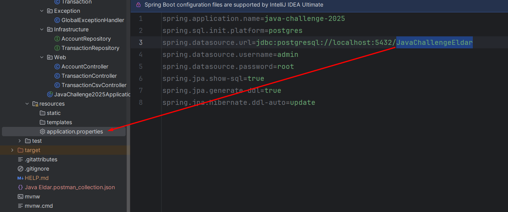
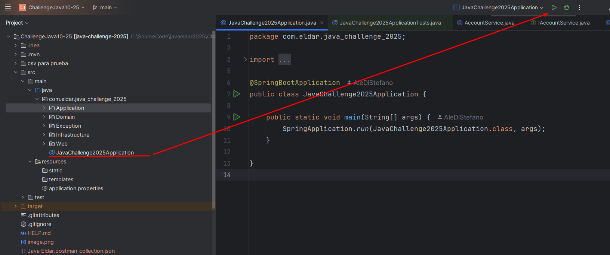
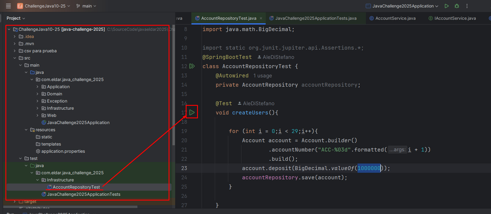
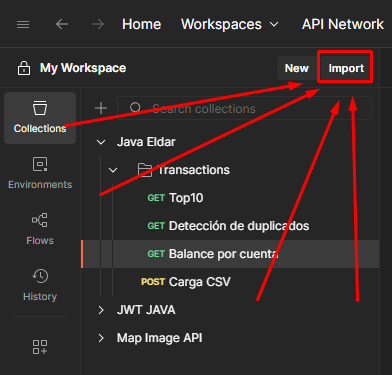
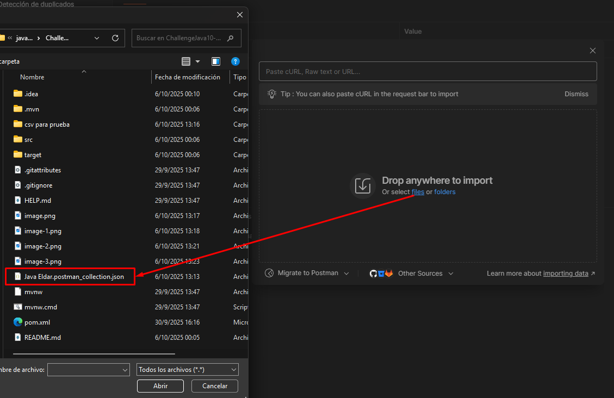
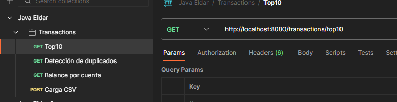
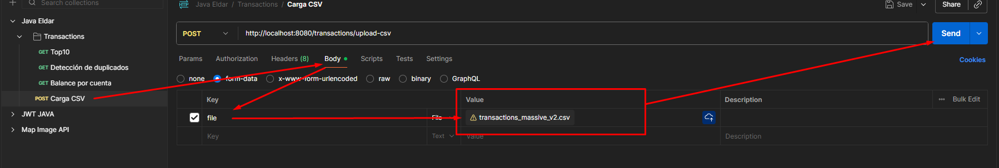
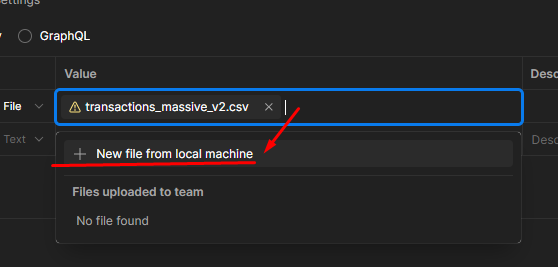
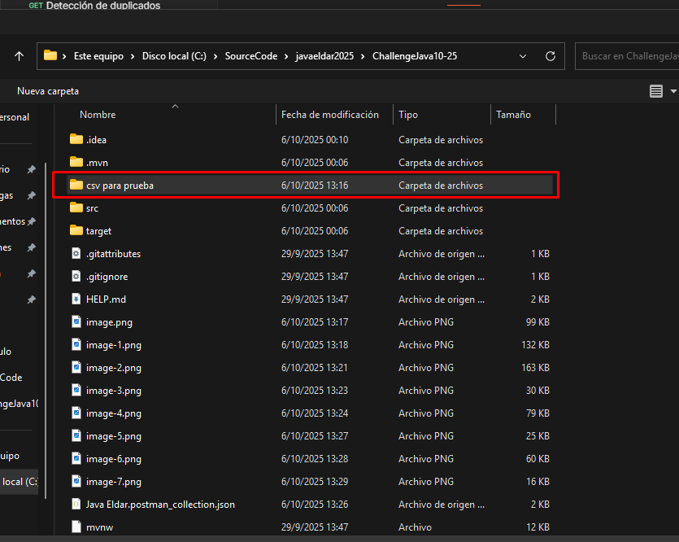

# ChallengeJava10-25
Sistema para procesar un CSV de transacciones y exponer consultas por API REST.

# Tech stack
- Java 17  
- Spring Boot (Web, Data JPA)  
- PostgreSQL  
- Maven 

## Requerimientos del challenge

- **Procesamiento**
  - Cargar y procesar un archivo **CSV** de transacciones.
  - Detectar transacciones **duplicadas**.
  - Manejar **líneas corruptas/ inválidas**.
  - **Persistir** el resultado para consultas posteriores.

- **Consultas (API REST)**
  - **Balance por cuenta**: dado un `accountId`, obtener el **balance final**.
  - **Top 10 cuentas**: listar las 10 cuentas con mayor **número de transacciones** procesadas (entrantes + salientes).
  - **Detección de duplicados**: dado un `transactionId`, verificar si **ya fue procesado**.

- **No funcionales**
  - Alto volumen de datos.
  - Respuestas eficientes.
  - Múltiples solicitudes concurrentes.

---
---

## Cómo ejecutar el proyecto

### 1) Prerrequisitos

- **Java 17** (JDK)
- **Maven 3.8+**
- **PostgreSQL 14+**
- Acceso a una consola (bash/powershell)

### 2) Base de datos

Crea la base vacía:

```sql
CREATE DATABASE "JavaChallengeEldar";
```


---

-Build & run
```console
mvn clean package
mvn spring-boot:run
```
---
-Ejecutar la aplicación desde JavaChallenge2025Application


-Ejecutar el test asociado a AccountRepositoryTest para crear usuarios de prueba que se ajusten a los casos del csv de ejemplo


-Dirigirse a postman y seleccionar la importación de colecciones


-Seleccionar el json llamado JavaEldar.postman_collection.json



ACLARACIÓN CSV:

La carga se realiza de la siguiente manera:
En body seleccionaremos form-data y debermos enviar la Key=file y en Value={{archivo csv}}



Al seleccionar importar desde archivo podemos acceder a la carpeta en el repo que contiene archivos de prueba:
